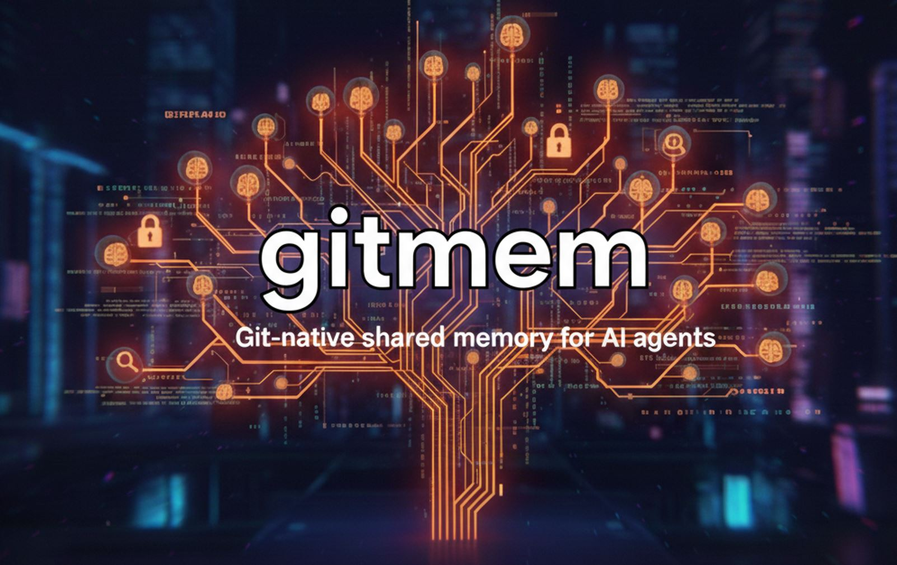

<p align="center">
  
</p>

# gitmem

**Git-native shared memory and MCP server for AI coding agents.**

A shared memory layer that runs on your filesystem and syncs through GitHub.
Any tool that can read a file gets the same context. In remote mode, facts can be governed through pull requests so memory is auditable, correctable, and versioned like code.

---

Your AI tools don't talk to each other. A fact learned by Claude Code — *postgres runs on 5433, ignore CORS warnings in dev* — is invisible to Codex, Copilot, Gemini CLI, or any other tool you use on the same codebase. Switch tools and you start from scratch.

Worse: when tools *do* remember things, there's no audit trail. A cheap model extracts a fact wrong and it persists silently — no provenance, no correction mechanism, no way to see what your agent "knows" or challenge it.

gitmem fixes both problems. Memory is stored as markdown files in git repos, synced through GitHub, and optionally governed through pull requests. Any tool that can read a file gets the same context. Facts are versioned, auditable, and correctable — like code.

**Your AI tools share a brain, and you can see exactly what's in it.**

> **Alpha release** — shipping today: local-mode memory repos, Codex/Copilot/Claude Code/OpenCode transcript capture, Claude Code live-hook install helpers, native-memory import adapters (including Claude Code), search/inject/view, and an MCP server. Still rough: GitHub PR governance is experimental, especially remote/hybrid review and provider-backed approval.

Want the full memory model, governance tiers, and 19 cognitive science references? Start with [gitmem-spec-v0_9.md](gitmem-spec-v0_9.md).

## The idea

Andrej Karpathy [described a pattern](https://x.com/karpathy/status/1913013338341937621) where an LLM maintains a wiki of its own knowledge — raw session transcripts are immutable source material, and the model distills them into structured, maintained pages.

gitmem takes that idea and builds it for the multi-tool coding workflow:

- **Git-native history** where the wiki has none — every fact change is a commit, every correction is traceable
- **PR-based governance** where the wiki has no review mechanism — cheap models propose facts, SotA models filter, humans resolve ambiguity
- **Encoding strength and provenance** where the wiki treats all knowledge equally — a fact read from source code outranks an LLM's guess, always
- **Multi-agent support** where the wiki is single-user — Claude Code, Codex, Copilot, Gemini CLI, and shim/manual-collect tools like Aider can share the same memory even when their live write paths differ
- **Cognitive science taxonomy** where the wiki has flat pages — episodic vs semantic memory, interference-based conflict resolution, cue-dependent retrieval

The wiki pattern is the right intuition. gitmem adds the engineering: governance, history, provenance, and multi-agent coordination.

## What sets it apart

**GitHub as the source of truth.** In remote or hybrid mode, memory repos live in a private GitHub org you own. Facts arrive via PR. You review what your agents "learn" the same way you review code. Branch protection, audit logs, and Actions workflows come free.

**Cognitive science, not vibes.** The memory model is grounded in established research — Tulving's episodic/semantic distinction, Anderson's activation strength, interference theory for contradiction handling, cue-dependent retrieval for injection. This isn't arbitrary; it's why the system handles conflict resolution, fact decay, and context-aware recall the way it does.

**Encoding strength, not flat confidence.** Every fact carries a strength from 1-5 based on *how* it was learned, not just a model's self-assessed confidence score. A function signature parsed from an AST (S:4) outranks a pattern inferred from logs (S:2), which outranks a single unconfirmed mention (S:1). Ground-truth code *cannot* be overruled by LLM inference — it's a hard rule, not a scoring tiebreak.

**Tool-agnostic by design.** gitmem is a filesystem convention and injection protocol, not a service. It doesn't wrap or replace your tools. Any CLI that can read a file and execute a hook can participate. The `gitmem` / `umx` CLI handles the pipeline; your agents just read and write.

**Zero required infrastructure in local mode.** No hosted service. Memory is markdown files in git repos. SQLite indexes are local build artifacts. The current local alpha works without model API keys.

**Dream pipeline.** After sessions end, a background pipeline extracts facts from transcripts, consolidates them against existing knowledge, detects contradictions, resolves conflicts by composite score, lints for drift, and prunes stale facts. The local alpha runs this natively today; the remote/hybrid governance path is included but still experimental.

## How it works

```
                    You
                     |
        +-----------+-----------+
        |           |           |
   Claude Code    Codex     Gemini CLI    ...any CLI agent
        |           |           |
        +-----------+-----------+
                    |
          gitmem / umx (capture)
                    |
        +-----------+-----------+
        |                       |
   sessions/                 dream pipeline
   (immutable logs)     extract -> consolidate -> lint -> prune
        |                       |
        +-----------+-----------+
                    |
              memory repo
         (markdown + git)
                    |
              GitHub sync
         (PRs, governance)
```

Memory is completely separate from your project repos. Project repos contain code. Memory repos contain cognition. They live in different GitHub orgs and only touch the project repo through a single `.umx-project` marker — no `.umx/` directories cluttering your code history.

gitmem is the reference implementation of the **UMX specification**.
The repo is `gitmem`, the Python package name remains `umx`, and both `gitmem` and `umx` CLI commands work.

## Install

Requires **Python 3.11+**.

Install from the `gitmem` repo. The package metadata is still `umx`, and the CLI exposes both `gitmem` and `umx`:

```bash
pip install git+https://github.com/dev-boz/gitmem.git
```

Or for development:

```bash
git clone https://github.com/dev-boz/gitmem.git
cd gitmem
pip install -e ".[dev]"
```

## Quick start

```bash
# Initialize memory home
gitmem init

# Initialize a project
gitmem init-project --cwd /path/to/project

# Capture a session
gitmem capture codex --cwd /path/to/project
gitmem capture copilot --cwd /path/to/project
gitmem capture claude-code --cwd /path/to/project
gitmem capture claude-code --cwd /path/to/project --all   # import all sessions, not just latest
gitmem capture gemini --cwd /path/to/project
gitmem capture opencode --cwd /path/to/project
gitmem collect --cwd /path/to/project --tool aider --file ./aider-session.txt
cat ./cursor-session.txt | gitmem collect --cwd /path/to/project --tool cursor

# Run the dream pipeline (extract, consolidate, lint, prune)
gitmem dream --cwd /path/to/project --force

# Search memory
gitmem search --cwd /path/to/project postgres

# Inject memory into a prompt
gitmem inject --cwd /path/to/project --prompt "postgres deploy flow"

# View facts
gitmem view --cwd /path/to/project --list

# Inspect overall memory health
gitmem status --cwd /path/to/project
gitmem health --cwd /path/to/project
gitmem doctor --cwd /path/to/project
gitmem doctor --cwd /path/to/project --fix
gitmem audit --cwd /path/to/project --cross-project
gitmem audit --cwd /path/to/project --cross-project --proposal-key "shared deploy checklist lives in docs/runbooks"  # read-only proposal preview only
gitmem propose --cwd /path/to/project --cross-project --proposal-key "shared deploy checklist lives in docs/runbooks"  # local proposal branch + commit only
gitmem propose --cwd /path/to/project --cross-project --proposal-key "shared deploy checklist lives in docs/runbooks" --push  # push proposal branch to origin only
gitmem propose --cwd /path/to/project --cross-project --proposal-key "shared deploy checklist lives in docs/runbooks" --open-pr  # open a PR for an already-pushed proposal branch

# Promote a fact into project or principle memory
gitmem promote --cwd /path/to/project --fact FACT123 --to project
gitmem promote --cwd /path/to/project --fact FACT123 --to principle

# Install Claude Code live hooks into project-local settings
gitmem hooks claude-code install --cwd /path/to/project

# Print the Claude Code hook block instead of writing it
gitmem hooks claude-code print

# AIP-style compatibility entrypoint
aip-mem status --cwd /path/to/project

# Start the MCP server
gitmem mcp
```

`umx` remains as a compatibility alias for existing setups.

## Optional signed commits

gitmem leaves commit signing off by default.

If you want gitmem/umx commits to use your existing Git signing setup, add this to `~/.umx/config.yaml`:

```yaml
git:
  sign_commits: true
  require_signed_commits: false
```

- `sign_commits: true` asks gitmem to run `git commit -S`.
- `require_signed_commits: true` makes commit failures fatal instead of silently continuing when signing is expected.
- Tests and local defaults do **not** require signing keys.

Custom redaction patterns can be set from the CLI and are stored under `sessions.redaction_patterns`:

```bash
gitmem config set redaction.patterns 'customer-\d+'
gitmem config set redaction.patterns '["ghp_[A-Za-z0-9]{36}", "ticket-[A-Z]+"]'
```

Custom matches are masked with the standard `[REDACTED:custom]` token before sessions are written.
For safety, custom patterns must be simple token-shape regexes; empty patterns, quantified groups, backreferences, lookarounds, and wildcard repeaters are rejected.

## How capture works

- `gitmem capture codex` imports existing Codex rollout JSONL files from `~/.codex` or a file you pass explicitly.
- `gitmem capture copilot` imports existing Copilot `events.jsonl` session logs from `~/.copilot/session-state/` or a file you pass explicitly.
- `gitmem capture claude-code` imports Claude Code session JSONL files from `~/.claude/projects/<hash>/` for the current project. Pass `--all` to import every session rather than just the latest; pass `--file` to target a specific file.
- `gitmem capture gemini` imports Gemini CLI session JSON files from `~/.gemini/tmp/<slug>/chats/`. It looks up the project slug in `~/.gemini/projects.json` based on the current directory.
- `gitmem capture opencode` imports OpenCode sessions from `~/.local/share/opencode/opencode.db`. It defaults to the latest session for the current project; pass `--all` to import everything or `--session-id` to target one session.
- `gitmem capture amp` imports Amp CLI thread JSON files from `~/.local/share/amp/threads/`. It defaults to the latest thread for the current project; pass `--all` to import every matching thread or `--thread-id` / `--file` to target one explicitly.
- `gitmem collect` stores manual or wrapper-exported sessions for tools without a native capture adapter yet. Use plain text for a single captured turn or `--format jsonl` to preserve multi-event records.
- Qodo, Cursor, Jules, and similar third-party CLIs are currently **shim/manual-collect surfaces**, not native transcript capture backends. Their shims inject memory; `collect` is the honest path for saving exported transcripts today.
- The tool reads files and hook outputs you point it at. It is not doing network interception or replacing the underlying CLI.

## Privacy and provider status

- In `local` mode, sessions, facts, and SQLite indexes stay on your filesystem.
- Session records are redacted before persistence, project-secret facts are excluded from injection, and facts tied to gitignored paths are routed to private scope.
- `remote` / `hybrid` mode syncs the memory repo to GitHub; your project code stays in its own repo.
- The local alpha does not require model API keys. The repo includes draft GitHub Actions templates that reference `GROQ_API_KEY` and `ANTHROPIC_API_KEY` for future provider-backed review; that path is still experimental.

## Remote mode (experimental)

Requires `gh` CLI installed and authenticated.

```bash
# Bootstrap with GitHub org
gitmem init --org your-github-org --mode remote
gitmem init-project --cwd /path/to/project

# Dream pipeline uses branch/PR scaffolding for review flows
gitmem dream --cwd /path/to/project --force
# → PR: [dream/l1] ... (#42)

# Review a PR proposal at the experimental L2 tier
gitmem dream --cwd /path/to/project --mode remote --tier l2 --pr 42

# Sync session history on main (fact changes still go through Dream PR branches)
gitmem sync --cwd /path/to/project
```

### Mode comparison

| | `local` | `remote` | `hybrid` |
|---|---|---|---|
| Facts | direct write | PR-scaffolded review flow (experimental) | PR-scaffolded review flow (experimental) |
| Sessions | local | explicit sync/hooks to main | explicit sync/hooks to main |
| Governance | none | L1/L2 scaffolding (experimental) | L1/L2 scaffolding (experimental) |
| Offline | yes | no | partial |
| Best for | solo / offline | team / audit | team / fast capture |

## Features

- **Dream pipeline** — Orient, Gather, Consolidate, Lint, Prune — native/local in this alpha, governance path experimental
- **Session capture** — `gitmem capture codex` / `gitmem capture copilot` / `gitmem capture claude-code` / `gitmem capture gemini` / `gitmem capture opencode` / `gitmem capture amp`, native memory import adapters, hooks, or MCP server
- **Claude Code live hooks** — project/user install helpers for session-start injection, pre-tool procedures, pre-compact sync, and session-end capture
- **MCP server** — `gitmem mcp` exposes read/write/search/dream/status tools over stdio
- **Budget-aware injection** — greedy-packs the most relevant facts into a token budget
- **Scope hierarchy** — user > tool > project > folder > file — facts injected at the most specific relevant level
- **Encoding strength 1-5** — ground truth code (S:5) to incidental mention (S:1), with composite scoring for trust, relevance, and retention
- **Provenance tracking** — every fact records extraction model, approval model, PR reference, and source sessions
- **Conflict resolution** — contradiction detection with `conflicts_with` pointers and supersession chains
- **FTS5 search** — full-text indexed fact search with optional semantic re-ranking
- **Attention refresh** — re-injects facts that have drifted too far from the active cursor in long sessions
- **Tombstones** — explicit forgetting mechanism that suppresses facts across future dream cycles
- **Procedures** — reusable playbooks and action rules, matched and injected at pre-tool time
- **Cross-scope promotion** — move facts into user, project, or principle memory with `gitmem promote --to ...`
- **Viewer surfaces** — fact inventory, task board/timeline, tombstones, session browser, audit view, manifest/lint/gap panels, and conventions display

## Alpha coverage

- **First-class transcript capture:** Codex, Copilot CLI, Claude Code, Gemini CLI, OpenCode, Amp
- **Native memory import adapters:** Claude Code, Copilot instructions, Aider
- **Integration surfaces:** MCP server, Claude Code live hooks, shims (including Amp/Qodo/Cursor/Jules), bridge files, search/inject/view, and `aip-mem`

The local-mode loop is in daily use. Remote and hybrid mode are included in alpha for bootstrap, PR scaffolding, and session sync, but that governance path is still the roughest part of the project.

## Roadmap

gitmem is releasing as alpha to get the core idea — governed, cross-tool, git-native AI memory — into the world. Here's where it's headed:

### Working in this alpha
- Local-mode dream pipeline (extract, consolidate, lint, prune)
- Codex, Copilot, Claude Code, Gemini, OpenCode, and Amp transcript capture
- Claude Code live-hook install/export workflow
- User/project/principle promotion via `gitmem promote --to ...`
- Cross-project audit via `gitmem audit --cross-project` to surface repeated project facts that may merit user-memory promotion
- Cross-project proposal preview via `gitmem audit --cross-project --proposal-key ...` (read-only preview with preserved evidence and target-topic resolution)
- Local cross-project proposal materialization via `gitmem propose --cross-project --proposal-key ...` (creates a local `proposal/...` branch in the user repo with one additive commit)
- Remote cross-project proposal branch push via `gitmem propose --cross-project --proposal-key ... --push` (pushes only the `proposal/...` branch after confirming local `main` exactly matches `origin/main`)
- Explicit cross-project PR open via `gitmem propose --cross-project --proposal-key ... --open-pr` (opens a PR only for an already-pushed proposal branch)
- Native memory import adapters for Claude Code, Copilot instructions, and Aider
- FTS5 search, budget-aware injection, richer viewer surfaces, shims, bridge files, MCP server, and `aip-mem`
- Remote/hybrid bootstrap, PR scaffolding, L2 review wiring, and session sync (experimental)

### Next
- **Claude Code live hooks** — broaden coverage beyond the current install helpers (more Claude events, richer relay/telemetry)
- **Read adapters** — generic CLI and hybrid gather across tools
- **Extraction quality** — better prompts, golden-test harness, benchmark framework
- **Provider-backed review** — turn the current remote/L1/L2 scaffolding into a provider-backed path with stronger provenance and merge policy

### Then: GitHub governance hardening
- **gitmem backend** — GitHub org bootstrap, push queue, PR pipeline
- **L1/L2/L3 governance** — cheap models propose (L1), SotA models review (L2), humans confirm (L3)
- **CONVENTIONS.md enforcement** — human-authored project schema drives extraction taxonomy
- **Audit trail** — session-to-fact traceability, deep therapy re-derivation
- **GitHub Actions** — workflow templates for automated dream cycles and lint PRs

### Later
- Web viewer with strength/scope/conflict filters, supersession timelines, and edit/confirm/promote actions
- Cross-project dream and principle promotion
- Semantic re-ranking (optional embeddings, hybrid search)
- Schema migration tooling, signed commits, hypothesis branches
- deeper `aip mem` runtime integration and published spec for third-party adoption

## Spec

The full specification — memory model, encoding strength taxonomy, dream pipeline, governance tiers, injection architecture, and 19 cognitive science references — is in [gitmem-spec-v0_9.md](gitmem-spec-v0_9.md).

## Development

```bash
pytest -q

# Focused test suites
pytest -q tests/test_codex_capture.py tests/test_copilot_capture.py tests/test_claude_code_capture.py tests/test_opencode_capture.py tests/test_golden_extraction.py
pytest -q tests/test_mcp_server.py tests/test_security.py tests/test_governance.py
```

## License

MIT — see [LICENSE](LICENSE).
