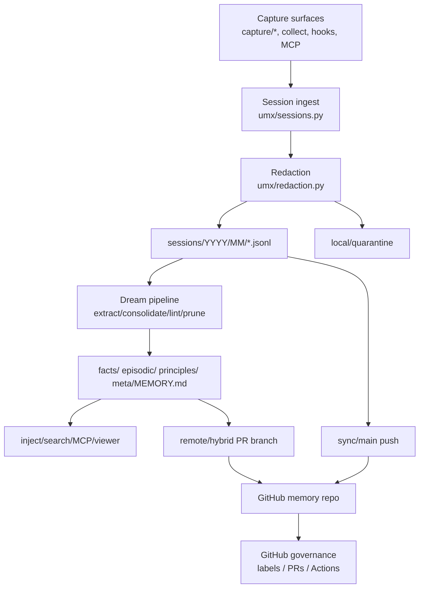

# gitmem threat model

## ADR

- **Status:** accepted, T2.1 complete
- **Date:** 2026-04-17
- **Owner:** copilot-cli
- **Scope:** current `gitmem` alpha codebase (`umx/`), with emphasis on session capture, redaction, sync, governance, and local/remote/hybrid trust boundaries

## Decision

Treat gitmem as a **local-first memory system with optional GitHub replication**:

- local mode trusts the workstation and local operator
- remote/hybrid mode add auditability and review, but also enlarge the trusted computing base to include git, `gh`, GitHub Actions, and provider credentials
- the main security boundary today is **redaction before persistence + push safety before sync**
- PR governance is a **safety layer for fact quality and change control**, not yet a complete containment boundary against a malicious local agent

## System context

## Assets and trust boundaries

| Asset | Why it matters | Primary boundary |
|---|---|---|
| `sessions/**/*.jsonl` | Raw evidence, most likely place for secrets | local filesystem, redaction, push safety |
| `facts/`, `episodic/`, `principles/`, `meta/MEMORY.md` | Durable injected memory | dream pipeline, push safety, governance |
| `local/private/` | private but injectable facts | gitignore only |
| `local/secret/` | credentials and non-injectable secrets | gitignore + explicit CLI access |
| bridge targets (`CLAUDE.md`, `AGENTS.md`, `.cursorrules`) | can leak memory into project repo | push safety when enabled |
| `~/.umx/config.yaml` | org, provider config, optional tokens/keys | local filesystem only |
| Git remote / GitHub org mapping | separates user vs project memory | slug resolution, repo layout, sync/proposal checks |
| GitHub Actions secrets | provider-backed review credentials | GitHub repo/workflow security |

## Security-relevant surfaces inspected

- session ingest and storage: `umx/sessions.py`, `umx/session_runtime.py`, `umx/collect.py`
- redaction and candidate fact masking: `umx/redaction.py`, `umx/dream/extract.py`
- push safety and git operations: `umx/push_safety.py`, `umx/git_ops.py`
- governance and sync controls: `umx/governance.py`, `umx/dream/pipeline.py`, `umx/cli.py`, `umx/github_ops.py`
- scope separation and cross-project promotion: `umx/scope.py`, `umx/cross_project.py`, `umx/inject.py`, `umx/memory.py`
- credential surfaces: `umx/config.py`, `umx/cli.py` secret commands, `umx/dream/providers.py`, `umx/actions.py`
- agent-facing interfaces: `umx/mcp_server.py`, `umx/claude_code_hooks.py`
- current test coverage: `tests/test_security.py`, `test_redaction_sessions.py`, `test_push_safety.py`, `test_governance.py`, `test_cross_project.py`, `test_doctor.py`

## Threat register (STRIDE)

| Surface | STRIDE | Concrete threat in this repo | Current controls | Gaps in current alpha | Recommended follow-up |
|---|---|---|---|---|---|
| Session capture ingress (`capture/*`, `collect`, hooks, MCP) | **S/T** | A local agent or wrapper can spoof session origin, feed arbitrary files, or forge session IDs to make untrusted content look first-party | most paths converge on `write_session()`; `_validate_session_id()` blocks traversal; session meta normalized; capture is file-read based, not network interception | no capture-source attestation; no hash/provenance of imported source artifact; MCP and hooks trust caller payloads | add capture provenance fields (adapter, source path, content hash); document local-caller trust assumption in CLI/MCP docs |
| Session persistence | **I** | secrets from transcripts land in committed `sessions/` and later sync to GitHub | synchronous redaction in `write_session()`; built-in regexes + entropy patterns in `umx/redaction.py`; validated user-managed custom patterns; adversarial synthetic fixture coverage across session and extractor paths; all first-class capture adapters call `write_session()` | raw mode is config-only and easy to misconfigure locally; client-side protections still rely on gitmem-managed paths rather than repo policy | keep expanding adversarial coverage and move more guarantees to server-side policy in M3 |
| Redaction failure handling | **D/I** | scanner crash, malformed regex, or malformed payload causes fail-open write or lost audit trail | `redact_jsonl_lines()` wraps exceptions; `write_session()` quarantines failed writes to `local/quarantine/`, stores metadata sidecars with failure reasons, and aborts commit; viewer supports release/discard with local decision logging | quarantine is still failure-only today; positive detections are masked in place rather than routed to a separate review queue; no retention policy for local quarantine artifacts | add quarantine retention/cleanup policy and keep status-facing surfaces consistent |
| Quarantine visibility | **R** | operator cannot tell that blocked sessions or push-safety reports exist, so risky data sits unresolved | `umx doctor` summarizes `local/quarantine/`; push safety writes JSON reports there; viewer now exposes a quarantine queue with masked previews and release/discard actions | `umx status` still does not surface quarantine even though spec says it should | add quarantine summary to `status` so CLI and viewer stay aligned |
| Candidate fact extraction | **I/T** | a secret survives session redaction or comes from gap/native-memory paths and gets promoted into `facts/` or injected prompts | `redact_candidate_fact_text()` applied in `dream/extract.py`; gitignored path routing moves referenced ignored files to `local/private/`; `Scope.PROJECT_SECRET` never injects; adversarial fixtures now assert raw synthetic secrets do not survive into derived fact text | `.gitignore` routing is heuristic only; no quarantine/review path for suspicious fact candidates beyond masking | evaluate fact-review/quarantine affordances after M2 if masked/high-entropy candidates prove too opaque |
| Push safety on sync / PR push / proposal push | **I** | secrets in facts, `MEMORY.md`, bridge files, or raw sessions are pushed to GitHub | `assert_push_safe()` scans committed diffs; blocks `sessions.redaction=none`; scans `facts/`, `episodic/`, `principles/`, `meta/MEMORY.md`, optional bridge targets; fails closed on scan error | only enforced when gitmem commands call it (`sync`, bootstrap, dream PR push, cross-project proposal push); plain `git push` bypasses it; no server-side action enforces same rule | keep current CLI checks, then add server-side equivalent after governance hardening; tie to **T3.5**/**T3.6** |
| Remote/hybrid session sync | **T/I** | fact files accidentally piggyback onto `main` during session sync, bypassing PR review | governed-mode path filters in `umx/governance.py`; `sync` rejects non-operational pending paths; dream branch stripping removes `sessions/` and `meta/processing.jsonl` from PR branches; tests cover sessions excluded from PRs | guardrails are in CLI/pipeline, not repo policy; direct git usage can still bypass | **T3.5** approval gating and **T3.6** branch protection to move this from convention to enforced policy |
| Cross-project separation | **I/T** | user memory syncs to project repo, or one project’s memory is pushed/opened against another repo/org | separate `$UMX_HOME/user` and `$UMX_HOME/projects/<slug>` repos; slug validation/collision handling; promotion requires explicit `--cross-project --proposal-key`; proposal push checks `origin/main` baseline and uses push safety; runtime GitHub remote-identity guards now assert the expected project/user target before sync/push/open-PR | safeguards are still client-side; raw git/gh usage can bypass them; non-GitHub remotes intentionally remain allowed for local workflows | carry the current guards forward into branch protection/server-side policy in M3 |
| Cross-project promotion flow | **S/R/I** | an agent opens or pushes a cross-project proposal against the wrong remote, or leaks credentialed remote URLs into output | proposal push/open-PR requires explicit second step; remote URLs are redacted with `redact_url_credentials()`; open-PR requires pushed remote branch and GitHub remote; runtime remote-identity checks now block mismatched GitHub targets | still relies on local repo custody and remote correctness outside gitmem-managed commands; no signed approval of who initiated promotion; no branch protection on user repo by default | **T3.6**, **T3.11** |
| Credentials in config and local secret storage | **I/E** | GitHub/provider secrets are stored in plaintext config or retrievable by any local process that can run the CLI | `local/secret/` is gitignored; `inject.py` excludes `Scope.PROJECT_SECRET`; `secret` CLI validates key names; provider env vars supported in `dream/providers.py`; remote URLs redacted in output; GitHub operations currently rely on authenticated `gh` CLI state rather than a gitmem-managed token | `UMXConfig.github_token` and `dream.paid_api_key` are plaintext fields; no file permission hardening; no secret-read audit trail; the reserved `github_token` config field is not part of the active GitHub auth path | prefer env/`gh auth` over config immediately; document plaintext-config risk now; **T3.11** rotation path; future secret-manager integration |
| GitHub Actions / provider-backed review | **E/I** | workflow job with provider secrets runs compromised code or unexpected package version | workflows now run with read-only `contents` permission; provider secrets flow through GitHub secrets; PR-only supply-chain job runs `pip-audit` and uploads a CycloneDX SBOM artifact; remote path is explicitly marked experimental; workflow templates now install gitmem from the source repo instead of the package index | actions are not yet SHA-pinned; no signed/pinned package artifact for workflow runtime; provider-backed review not fully hardened | pin/install from reviewed artifact or repo SHA before GA, and keep supply-chain scanning noisy-but-on by default |
| Commit signing | **R/T** | memory commits are unsigned or signing failures are ignored, reducing provenance and non-repudiation | `git_add_and_commit()` supports `-S`; `require_signed_commits` surfaces in `status` and `doctor`; init fails when signing is required and commit cannot be signed; sync/bootstrap/Dream/proposal/pre-compact managed push paths now verify signed outbound history | enforcement is still client-side only; raw git can bypass checks; no server-side signed-commit requirement or protected-branch policy yet | add branch protection/server checks in **T3.5**/**T3.6** |
| Governance review path | **T/R** | unreviewed or weakly reviewed fact changes merge, or review decisions are hard to reconstruct | governed modes block direct fact writes through CLI; PR proposals carry labels; L2 native rules escalate global impact, principles, deletions, contradictions; provenance stores `approved_by`, `approval_tier`, `pr` | current L2 is mostly native rules/scaffolding, not real provider-backed review; label lifecycle and approval gating are not automated yet; branch protection not auto-configured | **T3.1**–**T3.6** |
| Local mode | **E/T** | a malicious local agent can directly edit facts, run `secret get`, or bypass governance entirely | separation from project repo limits blast radius to memory repo; redaction still runs on normal ingest; secret facts are not injected | local mode intentionally has no governance; any process with local access is effectively trusted; no authz on CLI/MCP | document that local mode is convenience-first, not multi-actor hardened; recommend remote/hybrid for team/shared environments |
| MCP server and hooks | **S/E/I** | any local caller that can talk stdio or invoke hook commands can read memory, write session events, and influence dream/injection | MCP is stdio-only, not network-exposed by default; write path still goes through session runtime and redaction; hooks mostly call same underlying paths | no authn/authz layer; no per-tool allowlist; no audit record of who called `write_memory` or hook commands | keep local-only positioning; add optional audit metadata (`caller`, `pid`, `tool`) to session meta; consider disabling write tools in hardened mode |
| Insider / agent misuse | **E/R/I** | a compromised or over-permissioned agent uses `collect --file`, `capture --file`, `secret get`, or direct git commands to exfiltrate or persist sensitive data | explicit `secret get` required for `local/secret`; governed mode blocks some direct fact-write CLI paths; push safety catches many accidental leaks before gitmem-managed pushes | no least-privilege role model for local CLI; no audit of secret reads; no sandbox around capture source paths; direct git remains out of band | document trusted-local-actor assumption; add secret-read audit log and optional capture path allowlist after M2 baseline |

## Mode-specific risk profile

| Mode | Strongest controls today | Biggest residual risk |
|---|---|---|
| `local` | redaction before persistence, secret/non-secret injection split, no remote sync by default | any local agent with filesystem/CLI access can mutate facts or read secrets without governance |
| `remote` | push safety, sessions-only sync to `main`, facts routed to PR branches, future GitHub audit trail | GitHub/`gh`/Actions/provider credentials become part of TCB; current enforcement is still mostly client-side |
| `hybrid` | same fact-governance path as remote, but faster session availability on `main` | sessions still sync directly to `main`, so a redaction miss leaks faster than a fact-governance mistake |

## Current control assessment

### Strongest existing controls

1. **Single ingest choke point for sessions.** First-class capture adapters and `collect` converge on `write_session()`, which centralizes redaction and commit behavior.
2. **Pre-push safety net exists in code today.** `assert_push_safe()` already blocks common leaks and fails closed on scan errors.
3. **Project-secret facts are excluded from injection.** `inject.py` explicitly strips `Scope.PROJECT_SECRET`.
4. **Governed-mode path separation is real.** `sync` and dream PR code already keep `sessions/` and governed fact changes on different paths.
5. **Cross-project promotion is explicit, not automatic.** The extra `--proposal-key` step is an important anti-leak control.

### Most important gaps

1. **Quarantine visibility is still incomplete.** Viewer and local decision logging now exist, but `status` still does not surface quarantine.
2. **Push safety is not yet policy-enforced server-side.** `gitmem sync` is safer than raw `git push`, but raw git still bypasses the guard.
3. **Credential handling is still workstation-grade.** Plaintext config fields and no secret-read audit trail are acceptable for alpha, not for production sync.
4. **Signed commit enforcement is still client-side.** Managed push paths now verify signed history, but raw git and server policy can still bypass it.
5. **Remote identity/scope isolation is still client-side.** Runtime guards exist for gitmem-managed GitHub operations, but server-side branch/org policy is still needed.
6. **Local agent trust is implicit.** MCP, hooks, and CLI assume the caller is trusted; that needs to be documented as a boundary, not left implicit.

## Roadmap-aligned follow-ups

### M2 local status after the current batch

- **T2.2** — operators can now register validated custom redaction patterns
- **T2.3** — adversarial secret fixtures now cover sessions, extracted facts, entropy-only masking, and fail-closed quarantine metadata
- **T2.4** — quarantine queue, release/discard workflow, and local decision logging are now present in the viewer; `status` surfacing remains outstanding
- **T2.5** — `require_signed_commits` now verifies outbound history across managed bootstrap/sync/governance push paths
- **T2.6** — scope-isolation tests and runtime GitHub remote-identity assertions are now in place for gitmem-managed operations
- **T2.7** — PR-time supply-chain scanning and SBOM generation now run in CI, with action pinning/artifact hardening still ahead

### M3 should turn client-side safety into governance policy

- **T3.1/T3.2** — real L2 reviewer + eval harness
- **T3.3/T3.5** — label state machine and approval gating
- **T3.6** — branch protection auto-setup so PR review is enforced by GitHub, not just by CLI convention
- **T3.9** — hardened `gh` retry/rate-limit handling to reduce unsafe operator workarounds
- **T3.10** — governance health surface
- **T3.11** — cross-org support and credential rotation procedure

## Bottom line

gitmem already has the right **shape** for a safe sync story: redact before write, scan before push, keep secrets out of injection, and separate governed fact changes from append-only session sync.

The main production blockers are not missing theory; they are missing **hardening and enforcement**:

- quarantine UX
- adversarial redaction coverage
- signed-commit enforcement
- scope-isolation guarantees
- server-side governance/branch protection
- clearer handling of local credentials and trusted-agent assumptions
